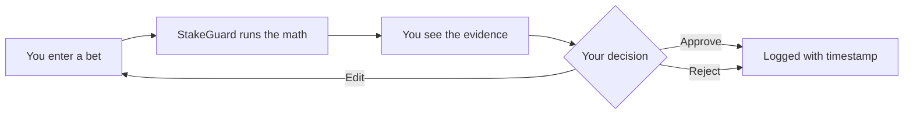
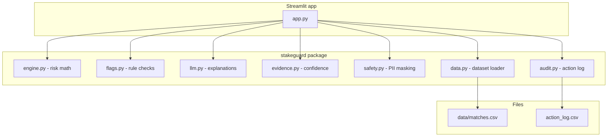

# StakeGuard

**Your personal betting risk advisor. Think first, bet smarter.**

StakeGuard is a web app that checks a bet before you place it. You type in
the match, the market, the odds, and how much you want to stake. StakeGuard
does the math, shows you the real numbers, and tells you honestly whether
the bet is worth it.

It is not a tipster. It will not predict winners. It is a second pair of
eyes that protects your money, especially on the days when you feel like
chasing a loss.

---

## The problem

Most bettors decide with their emotions:

- They bet big after a bad day.
- They chase losses with bigger stakes.
- They take odds that the math says are bad value.

By the time they look at the numbers, the money is already gone.

**StakeGuard changes the order: check first, decide second.**

---

## How it works



A bet goes through six clear steps:

1. **You enter a bet.** Match, market, odds, stake, bankroll, and an
   optional mood note.
2. **The math runs in plain Python.** No black box, no guesswork.
3. **Warning signs are checked.** Tilt words, oversized stakes, poor value.
4. **The evidence is shown.** Every number with the source behind it.
5. **You decide.** Approve, Edit, or Reject. Nothing finalizes on its own.
6. **The decision is logged.** Timestamped, so you can see your history.

---

## What StakeGuard calculates

| Metric | What it means |
|---|---|
| Implied probability | The chance the odds imply (1 / odds) |
| Expected value (EV) | How much this bet makes or loses on average |
| Edge | How much better the real chance is than the odds say |
| Stake % of bankroll | How big the bet is compared to your budget |
| Risk score (0-100) | One clear number for how risky the bet is |
| Risk label | Low, Medium, or High, shown as a colored badge |

---

## Safety by design

StakeGuard is built around trust and control:

- **Visible evidence.** Every risk label comes with the exact numbers behind
  it.
- **Human in control.** Approve, Edit, or Reject. The app never finalizes a
  decision on its own.
- **Emotional detection.** Rule-based flags catch tilt, revenge bets, and
  oversized stakes.
- **Action log.** Every decision is recorded with a timestamp.
- **PII masking.** Email, phone, and social handles are hidden before a note
  is stored.
- **Honest refusal.** If the data cannot answer, StakeGuard says so. It
  never makes things up.
- **Confidence labels.** High, Medium, or Low, based on data quality.

---

## Example walkthrough

*(Illustrative example, not a live computation.)*

A user is thinking about a bet:

```
Match:    Northside FC vs Southpark United
Market:   home_win
Odds:     2.19
Stake:    $50
Bankroll: $1000
Mood:     "just lost three in a row, need to win it back"
```

StakeGuard responds:

- **Risk label:** High
- **Risk score:** 72 / 100
- **Expected value:** negative
- **Warning signs:** emotional language detected ("lost three", "win it
  back")
- **Safer alternative:** consider not betting, or reduce the stake well
  below $50

The user must approve, edit, or reject. Nothing is logged until they do.

---

## Architecture



**Design rules:**

- The math never depends on the AI. If the AI is down, the numbers still
  work and template text explains them.
- The human gate is real. No decision is logged without a button click.
- Every module has one job. Small, readable, testable.

---

## Getting started

```bash
# 1. Install the packages
pip install -r requirements.txt

# 2. Run the app
streamlit run app.py
```

That is it. The app opens in your browser at http://localhost:8501.

An API key is optional. StakeGuard works fully without one. The AI layer
only writes nicer explanations; all the math is plain Python. See
[docs/setup.md](docs/setup.md) for details.

---

## Tests

```bash
pytest
```

The test suite covers the risk math, the rule checks, the AI layer, the
action log, the dataset loader, PII masking, and the confidence logic.

---

## Documentation

- [Setup guide](docs/setup.md): install and run the app
- [User guide](docs/usage.md): how to use StakeGuard
- [Architecture](docs/architecture.md): how the app is built
- [Architecture diagram](docs/diagram.md): visual flow of the app
- [Data guide](docs/data.md): the match dataset
- [Trust and safety](docs/safety.md): the safety features
- [Disclosures](docs/disclosures.md): datasets and dependencies
- [Launch checklist](docs/launch-checklist.md): ready-to-share checks

---

## The data

The app runs on a small synthetic match dataset that ships with the project.
Synthetic data means it was generated for this project, so there are no
licensing issues and no real personal data anywhere. See
[docs/data.md](docs/data.md) for details.

## Project layout

```
app.py                 Streamlit entry point
src/stakeguard/        The logic package
docs/                  Simple-English documentation
data/                  Synthetic match dataset
tests/                 Automated tests
```

---

**Think first. Bet smarter.**
