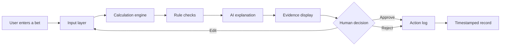
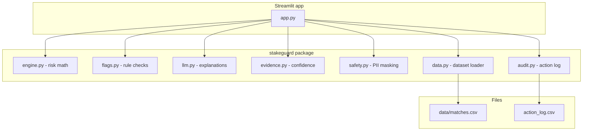

# Architecture diagram

This page shows how StakeGuard works from input to output. The diagram uses
Mermaid, which renders automatically on GitHub and in many Markdown editors.

## Flow diagram

## What each box does

- Input layer: match, market, odds, stake, bankroll, optional mood note.
- Calculation engine: implied probability, expected value, risk score.
- Rule checks: emotional language, oversized stake, poor value, high
  variance.
- AI explanation: plain-language summary and a safer alternative. Uses
  template text when no API key is set.
- Evidence display: the exact numbers, source table, and warning signs.
- Human decision: Approve, Reject, or Edit. Nothing is logged without it.
- Action log: every decision with a timestamp.

## Component diagram

